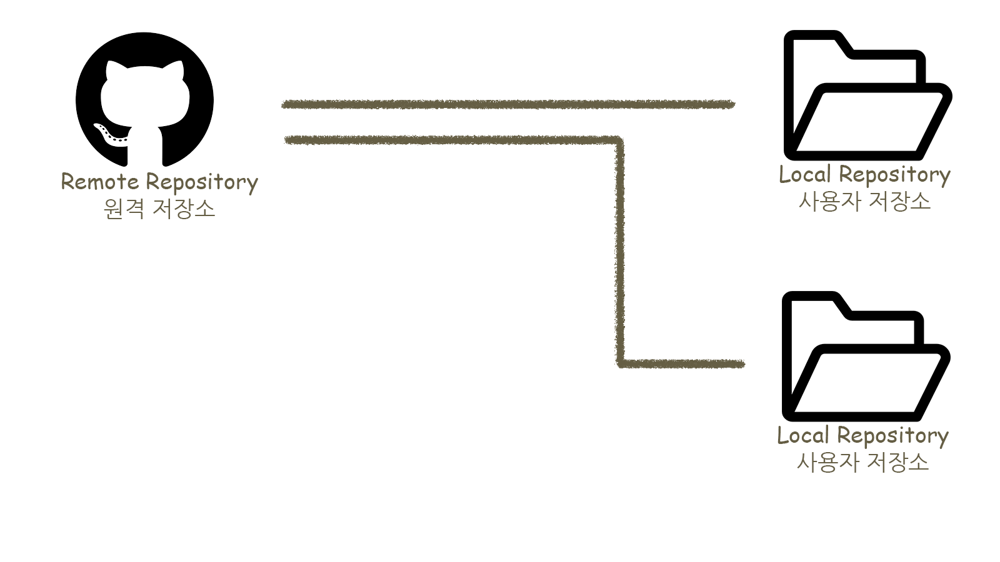
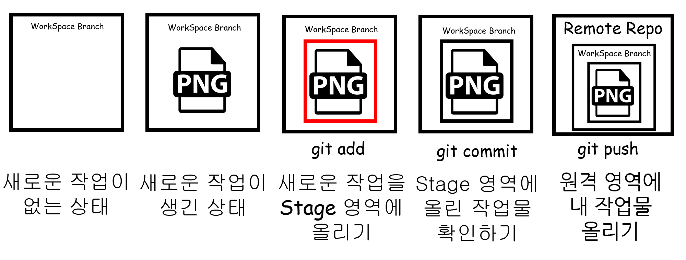

# Git이란?
Git은 작업물을 안전하게 저장하고, 공유하고, 되돌릴 수 있게 해주는 버전 관리 도구다.

## 1️⃣ 기본 개념
내 PC에서 만든 작업물을 외부 저장소(GitHub, GitLab 등) 에 업로드한다.  
다른 PC에서는 그 작업물을 다운로드해서 이어서 작업할 수 있다.  
반대로, 다른 사람이 만든 작업물을 받아서 내 PC에서 작업할 수도 있다.  
즉, PC가 바뀌어도, 사람이 바뀌어도 같은 작업을 이어갈 수 있게 해주는 시스템이다.  

## 2️⃣ 왜 필요한가? (버전 관리)
작업하다 보면 이런 상황이 생긴다:
```
최종_시안.png
최종_시안_(1).png
진짜최종.png
이게_마지막_시안.png
```
뭐가 진짜 최신인지 헷갈리고, 이전 상태로 되돌아가기도 어렵다. Git은 이걸 자동으로 관리해준다.

작업할 때마다 변경 이력(버전) 을 기록하고,
가장 마지막 작업이 최신 버전으로 관리된다.  
필요하면 과거 버전으로 언제든지 되돌릴 수 있다.  
👉 파일 이름으로 버전 관리하는 고통을 없애주는 도구다.

### 3️⃣ 한 문장 요약
>Git은 작업물을 외부에 안전하게 저장하면서, 변경 이력을 기록하고,  
협업과 되돌리기를 가능하게 해주는 버전 관리 도구다.  

| 명령어 | 의미 |
|---|---|
| clone | 처음 받아오기 |
| add | 커밋할 파일 선택 |
| commit | 버전 저장 |
| pull | 최신 받아와서 합침 |
| merge | 서로 다른 작업 흐름(브랜치)을 하나로 합침 |
| fetch | 최신 확인만 |
| push | 내 작업 업로드 |
| checkout | 시점/브랜치 이동 |
| reset | 되돌리기 |
| stash | 임시 보관 |

깃에서 자주하는 행동들을 정리한 표입니다.  
이것들만 익숙해지면 Git을 거의 마스터한 급입니다.  
명령어에 대해 이해를 올리면서 Git이 어떻게 돌아가는가? Git의 구조에 대해 이야기를 하겠습니다.  

  

원격 저장소는 서버인 원격의 컴퓨터로 인식하면 좋고,  
각각의 사용자들은 사용자끼리 파일을 주고 받는게 아닌 원격하고만 주고 받아진다는 점입니다.  
중앙 집권식의 방식으로 상상하면 Git에 대해 좀 더 쉽게 이해할 수 있습니다.  
  
그러면 이제 원격하고 사용자하고 어떻게 과정이 이루어지는가를 예시를 들어보겠습니다.  

  

저 새로운 작업이란 것은 파일의 수정사항과 새로운 파일이 등록되었을 때 생기는 것입니다.  
왼쪽부터 오른쪽으로 순서대로 일이 일어납니다.  
우리가 택배를 보낼 때와 같은 순서로 생각하면됩니다.  
## Git을 예시로 표현하기
1. 택배를 보낼 물건 고르기 - 새로운 작업이 생긴 상태
2. 물건을 상자에 담기 - 새로운 작업을 Stage 영역에 올리기 [git add] 
3. 상자를 포장하고 운송장 쓰기 - Stage 영역에 올린 작업물 확인 도장 [git commit]
4. 택배를 우체국에 넘기기 - 원격 영역에 내 작업물 올리기 [git push]  

여기까지가 기본적인 Git을 사용하는 작업입니다.  
여기서 예외 상황과 동시에 작업이 들어가는 경우에 대해서 다음편에 정리하겠습니다.