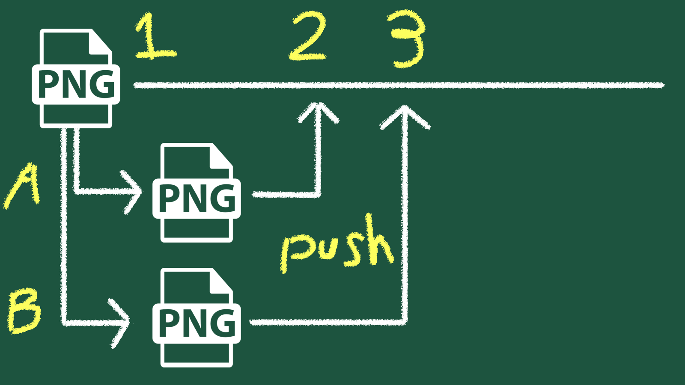

## Git push, clone/pull/chechout
이번 포스트는 Git에서 작업내역을 보내는 과정에서 생기는 이슈와  
역으로 작업내역을 받는가?에 대해서 다루겠습니다.  
  
Push를 할 때, 우리는 수정된 작업 내용을 올리는 행위를 하게됩니다.  
근데 언제 작업시점을 기준으로 언제 작업내역을 수정을 완료했는가?에서 예외적인 상황이 생기게 됩니다.  


1. 시점 1
- A와 B는 같은 시점(시점 1) 의 작업물을 기준으로 각각 로컬에서 수정을 시작합니다.

2. 시점 2 – A의 Push
- A가 먼저 작업을 끝내고 Push를 진행합니다.
- 이로 인해 원격 저장소는 시점 2가 되며, A의 수정 사항이 정상적으로 반영됩니다.

3. 시점 3 - B의 Push 시도
- B는 여전히 시점 1 기준으로 작업을 진행한 상태입니다.
- 이 상태에서 B가 Push를 시도하면, 이미 누군가(A)가 작업을 진행했기 때문에 Push가 거부됩니다.

4. Pull을 통한 최신화
- B가 Push를 하려면 먼저 Pull을 해서 원격 저장소의 최신 상태(시점 2)를 받아와야 합니다.
- 이 과정에서:
 = B가 수정하지 않았던 A의 변경 내역이 B의 로컬 작업 내역에 합쳐집니다.
 = 하지만 같은 파일의 같은 부분을 수정한 경우, 충돌(Conflict) 이 발생합니다.

5. Conflict 발생
- 이 시점에서 Git은 A의 작업물과 B의 작업물에서 사용자가 직접 선택하도록 요구합니다.
- 이 상황을 Conflict(충돌) 라고 합니다.

6. Conflict 해결 방식
- 보통은 작업자끼리 협의하여 어떤 수정 사항을 살릴지 결정합니다.
- 하지만 저는 보통:
  * 제 작업을 날리는 방식을 선택합니다. 협의 과정이 필요 없고,
  * Push 전에 충돌이 날 것을 미리 예측해 해당 부분에 예비 파일을 만들어 둡니다.
  * 이후 Pull → Push를 한 다음, 다시 필요한 수정을 진행하여 재차 Push하는 방식을 선호합니다.  

## Branch
보통 협업 시에는 Dev 혹은 Main 브랜치를  
작업의 기준이 되는 중심 축으로 둡니다.  

이 기준 브랜치는 항상 정상적으로 동작해야 하며,  
빌드 및 테스트가 가능한 안정적인 상태를 유지하는 것이 목적입니다.  

이 기준 브랜치에서 추가적인 기능을 개발하거나,  
기존 로직을 수정하는 작업들은 메인 흐름에서 바로 진행하기보다는 곁가지,  
즉 Branch로 분리하여 관리합니다.  

이렇게 Branch를 새로 생성해 작업을 분리하면,  
작업 내용을 격리(Isolation) 할 수 있고,  
기준 브랜치를 망가뜨리지 않으면서,  
변경 사항을 관리 가능한 단위로 유지할 수 있습니다.

### Branch 나누기 장점
1. 작업 격리 (Isolation)  
각 작업을 별도의 브랜치에서 진행함으로써, 미완성 기능이나 실험적인 수정이 기준 브랜치에  
직접적인 영향을 주지 않도록 할 수 있습니다. 작업 중 문제가 발생하더라도 해당 브랜치만 정리하거나  
삭제하면 되기 때문에 리스크를 최소화할 수 있습니다.


2. 안정성 유지 (Stability)  
main 또는 dev 브랜치는 항상 안정적인 상태를 유지하는 것이 중요합니다.  
브랜치를 통해 작업을 분리하면, 개발 중인 코드로 인해 기준 브랜치가 깨지는 상황을 방지할 수 있으며,  
QA, 테스트, 배포 기준점으로 활용하기에도 적합합니다.  

3. 리뷰 & 협업 (Review)  
브랜치 단위로 작업하면 Pull Request를 통해 변경 내용을 명확히 확인할 수 있습니다.  
아래의 내용들을 사전에 공유하고 검토할 수 있어서 협업 품질이 향상됩니다.  
    - 어떤 파일이 수정되었는지
    - 왜 이런 변경이 필요한지
    - 충돌 가능성은 없는지  

4. 작업 단위 관리 (Feature 단위)  
기능, 이슈, 작업 티켓 단위로 브랜치를 나누면 변경 사항의 범위가 명확해집니다.
    - 특정 기능만 선택적으로 병합
    - 문제 발생 시 해당 작업만 롤백과 같은 관리가 수월해집니다.

5. 병렬 작업 (Parallel Work)  
여러 작업자가 동시에 서로 다른 브랜치에서 작업할 수 있어,  
작업 간 간섭을 최소화할 수 있습니다.  
   - 한쪽에서는 신규 기능 개발
   - 다른 한쪽에서는 버그 수정
   - 또 다른 한쪽에서는 최적화 작업을 동시에 진행할 수 있어 전체 개발 속도가 향상됩니다.  

6. 배포 전략 (Release / Hotfix)  
브랜치를 활용하면 배포 흐름을 명확하게 분리할 수 있습니다.
   - release 브랜치: 배포 직전 안정화 작업
   - hotfix 브랜치: 운영 중 발생한 긴급 수정  
   
    운영 버전과 개발 중인 버전을 분리 관리할 수 있으며, 예기치 않은 문제에도 빠르게 대응할 수 있습니다.

### Branch 정리
>Branch는 단순히 컨플릭트를 줄이기 위한 수단이 아니라,  
작업을 안전하게 분리하고, 협업과 관리, 배포까지 고려한  
개발 흐름을 구조화하는 도구라고 볼 수 있습니다.  

## clone, checkout, pull
clone – 처음 받을 때, 원격저장소를 내 컴퓨터로 통째로 복사
- 처음 한 번만 사용
- .git 포함해서 히스토리까지 전부 가져옴  

checkout - 브랜치/시점 이동, 다른 브랜치나 특정 작업 상태로 이동
- 팀 작업할 때 브랜치 이동 용도
- "이 사람이 어느 자업 기준인지" 맞출 때 필수  

pull - 최신 상태로 갱신, 원격 저장소의 변경사항을 가져와서 바로 합침
- 남이 수정한 최신 작업 반영
- 보통 하루 작업 시작 전에 한 번하길 권함

### .git이란?
> 이 폴더가 Git 저장소라는 사실을 정의하는 핵심 데이터베이스  
1. 커밋 히스토리(로그)
2. 브랜치 / 태그 정보
3. 변경 사항 비교용 정보
4. 원격 저장소 정보

```
project/	← 📁 작업 디렉토리 (Working Directory)
 ├─ .git/        ← Git의 뇌 🧠 (히스토리/규칙/상태)
 ├─ Assets/
 ├─ Source/
 └─ README.md
```