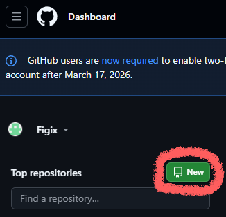
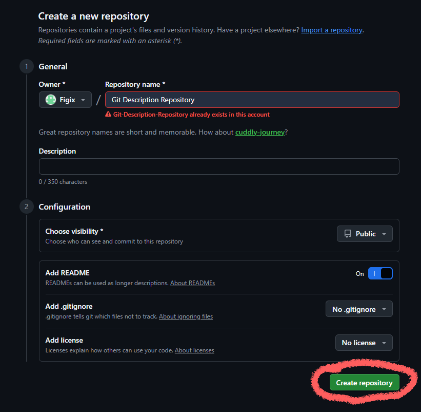
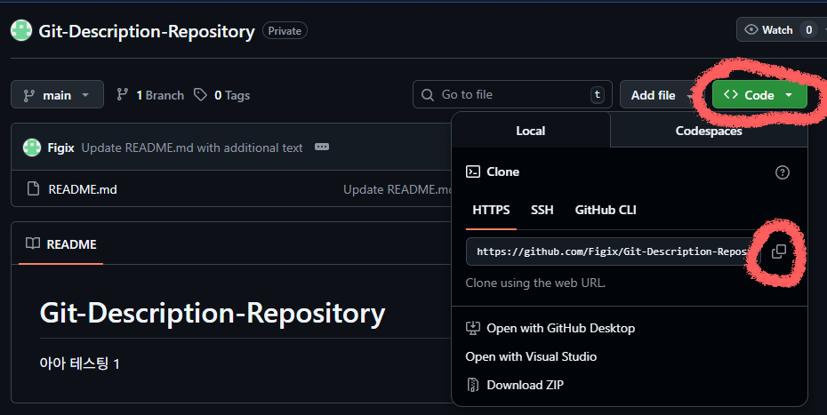

## Git Bash[CLI] & Git Fork[GUI]
Git bash[CLI] 환경으로 사용하는 간단한 팁과 Git Fork[GUI] 환경하는 방법으로 포스팅을 다루겠습니다.  

| 내용 | 링크 |
|:---:|:---:|
| Git Bash [CLI - 키보드위주의 환경] | https://git-scm.com/install/ |
| Git Fork [GUL환경 - 마우스 사용하기 좋은 환경] | https://git-fork.com/ |
| Github | https://github.com/dashboard |

위 링크로 다운로드를 진행해주세요.  

그림대로 따라오시면, 깃주소를 복사하는 것까지 따라오실 수 있습니다.  
이제 Git Bash를 열어볼까요?  

### Git Bash[CLI]
  
Bash를 쓰기 위해서는 최소한 아래의 명령어에 익숙해지셔야합니다.

| 명령어 | 역할 |
|:---:|:---:|
| cd /c | c 드라이브로 이동 |
| cd src | 현재 위치에서 src라는 폴더로 이동 (없으면 이동X) |
| cd .. | 상위 폴더 위치로 이동하기 |
| ls | 현재 디렉토리의 파일 및 폴더 리스트업 기능 |

  
1. cd /d - d드라이브로 이동합니다.
2. cd Testdir/ - d드라이브 안 TestDir라는 폴더로 이동합니다.
3. ls - /d/Testdir 폴더 내 정보들을 표기합니다.
4. cd base/ - TestDir내 base라는 폴더로 이동합니다.
5. git clone 복사한 주소  
(https://github.com/Figix/Git-Description-Repository.git)
6. ls - /d/Testdir/base 폴더 내 정보들을 표기합니다. [clone한 폴더 확인]
7. cd Git-Description-Repository/ - base폴더 안에 폴더 이동

(main)이 뜬다면 현재 .git이 있는 폴더에 들어온 것이고,  
현재 위치는 main 브랜치이란 뜻입니다.  

그리고 깃주소를 가져올 때, Ctrl+v가 잘안될 것입니다.  
Ctrl+Insert로 붙여넣기를 해주세요. 

야무지게 clone한 모습입니다.

아래에서 변경사항을 추가하겠습니다.

git status - 현재 수정된 사항들 리스트업  
git add 파일명 - 해당 파일을 Stage에 올리기  
git commit - Stage에 올릴 것들을 확정하고, 무엇을 올리는지 설명하는 구간  

#### 📝 Git 커밋 시 나오는 창 설명 (vim 기준)
Git에서 커밋을 하면 vim 편집기 창이 열립니다.  
i 키를 누르면  
→ Insert 모드로 전환되어  
→ 커밋 메시지를 입력할 수 있습니다.  
(이때 입력하는 글씨가 보통 노란색으로 보입니다)  
커밋 메시지를 모두 작성했다면  
→ Esc 키를 눌러  
→ 입력 모드(Insert)를 종료합니다.  
:wq 명령어를 입력합니다.  
→ Write(저장) Quit(종료) 커밋이 완료됩니다.  
  
git status - 커밋이 정상적으로 잘 들어온 것을 확인  
git push - 해당 내용을 원격 저장소에 올리기  

Png와 README 수정된 내용들이 잘 올라왔습니다.  
  
## Git Fork[GUI]

그러면 이제 의도적으로 Conflict(충돌)가 나오게 한번 수정해볼까요?  
하지만, git bash로 일일히 타이핑해가며 작업하는건 너무 불편합니다.  
CLI로 Git을 다루는건 어느정도 익히셨을테니, GUI인 Fork로 작업을 시작하겠습니다.  

먼저 Fork를 열어주세요.  
File - Open Repository[Ctrl+O]  
.git이 나오는 폴더 구간이 나오는 폴더에서 폴더 선택을 눌러주시면 됩니다.  

### Git Fork만의 중요 개념들
| 심볼 | 역할 |
|:---:|:---:|
| Git 고양이 마크 | 해당 브랜치가 원격 레파지토리에서의 최신화된 영역 |
| ✅ | 현재 내 시점 |
| 상단의 밑줄 | 현재 브랜치의 헤드명(위치) |

### Git Fork에서 브랜치 나누기

| 체크박스 ☐ | 브랜치만 생성하기 |
|:---:|:---:|
| 체크박스 ☑ | 브랜치를 생성한 후, 브랜치 헤드를 해당 위치로 이동하기 |

위 방식으로 현재 브랜치를 2개 개설한 상황입니다.  
Readme 수정이라는 로그에서 2개를 개설했습니다.  
해당 로그를 기준으로 userA, userB, Main이라는 브랜치가 생성되었고,  
userB에 ✅가 있으므로 현재 브랜치 명은 userB이며, Readme 수정이 현 위치입니다.

### Git Fork CheckOut

  
일단 userA로 헤드를 바꾸고[Checkout], 수정작업을 먼저 진행해보겠습니다.  
깃의 헤드를 바꿀려면 여러방법이 존재하는데, 위 두 그림의 방식으로 추천드립니다.  
왼쪽 탭을 활용해 헤드를 바꾸는 방식은 최신 헤드로 이동하는 방식입니다.  

### Git Fork Add, Commit, Push
  
현재 기존과 다른 피카츄 이미지를 2장을 넣고,  
하나는 기존과 이름을 같게해서 파일의 수정사항을 만든 상황입니다.  

왼쪽탭에 Local Chage에 변경사항이 생겼으니 클릭해서,  
들어가면 위와 같이 창이 변경됩니다.  
Stage 버튼을 통해서 Unstatged에서 Stage로 옮깁니다.  
Stage로 올리고싶지 않은 파일은 날리면 됩니다.  

Delete 키를 통해서 해당 파일을 날릴 수도 있습니다.  
폴더에서 아예 지우는 것이니 조심히 사용하길 바랍니다.  

Commit의 로그를 작성해 로그명을 정해주세요.  
Commit버튼을 통해 Commit을 해주세요.  
  
userA라는 커밋 로그가 생겼지만, 고양이 마크가 없습니다.  
즉 아직 원격에는 올라간상태가아닙니다.  
이제 Push를 때려볼까요?  

깃 고양이 마크가 생겼네요. 이제 해당 로그 영역이 제일 최신화된 영역입니다.  
자 이제 userB 브랜치로 checkout해서 작업을 진행해볼까요?  

  
userA에서 피카츄 이미지2개가 있지만, userB는 1개이며,  
Pokémon_Pikachu_art.png라는 파일이 서로 다르게 나오고 있습니다.  

userA의 작업내역이 userB하고는 완전히 분리된 것을 확인했습니다.  
  
Pokémon_Pikachu_art.png 파일을 변경하고, Commit하고 Push하겠습니다.  

그럼 지금까지의 작업내역을 한번 정리하겠습니다.  
  
현재 각 브랜치별로 서로 다른 피카츄 PNG파일들이 있는 모습입니다.  

### Git Fork Merge
이제 작업한 내역들을 main에 올리는 작업을 진행하겠습니다. 먼저 userA부터 넣겠습니다.  
  
Merge는 현재 HEAD에 다른 브랜치의 작업내역을 끌어오는 행위를 말합니다.  
즉 Main 브랜치에서 userA의 작업 내역을 Merge를 해야합니다.  
  
이대로 Merge를 진행해주시면됩니다.  

  
Merge를 하면 꼭 Push를 진행해야합니다.  
그림을 보면 main의 commit된 것같은 내역이 남아있습니다.  
push한 후 모습으로 깃 고양이가 main 브랜치의 최신을 잘보여주네요.  

main 브랜치가 userA와 파일구조가 같게 된 것을 확인했습니다.  
자 이제 userB도 Main쪽으로 Merge해볼까요?  

### Conflict?

Conflict(충돌)가 생겼습니다. 왜 생겼을까요?  

현재 Pokémon_Pikachu_art.png파일이 작업내역이 겹쳐서 생긴 이슈가 발생된것으로 파악됩니다.  
저는 userB를 선택해서 main브랜치 안에 userB의 거대 피카츄 이미지를 넣겠습니다.  
commit하고 push까지 진행하겠습니다.  

정상적으로 main브랜치가 최신화가 되었습니다.

자 그럼 지금까지 상황을 그림 정리하면 위와 같습니다.  
이정도만 이해하고 있으면, 여러분도 깃으로 협업할 수 있습니다.  

다음 포스트에는 추가적인 깃 활용 꿀팁들에 대해 다룰 예정입니다.  
Reset과 Stash를 쓸 예정이옵니다.